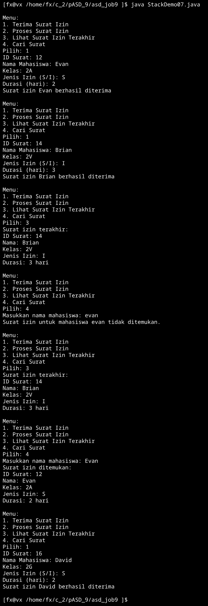
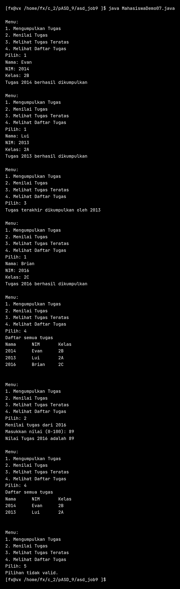
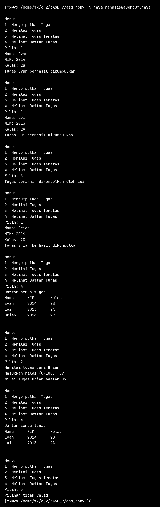
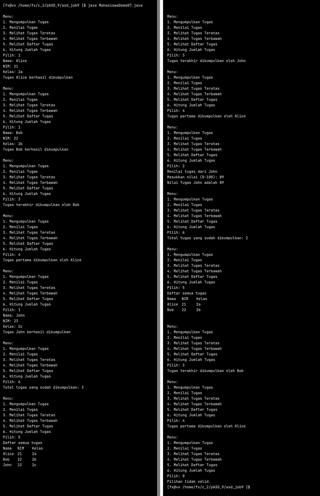
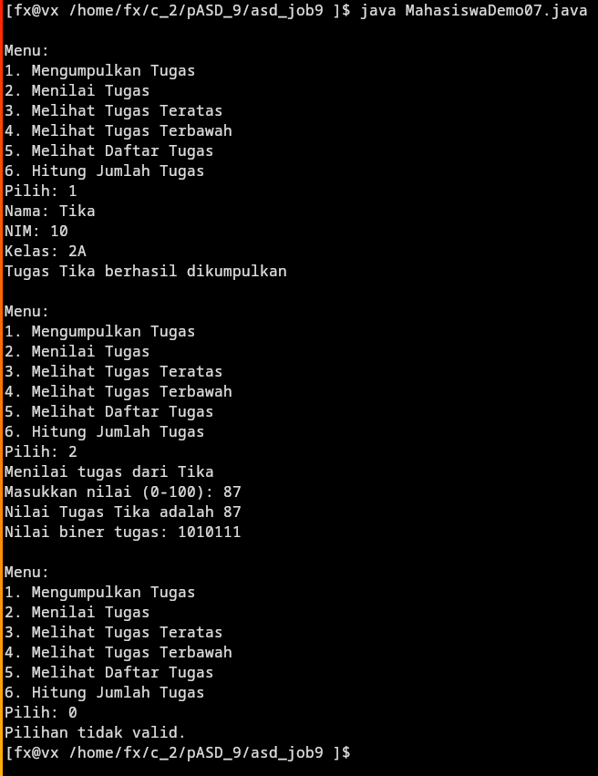

## [Latihan Praktikum](#latihan-praktikum)  \  [Daftar_Percobaan](#daftar_percobaan)  


# Latihan Praktikum
### Soal :  
Mahasiswa mengajukan surat izin (karena sakit atau keperluan lain) setiap kali tidak mengikuti perkuliahan. Surat terakhir yang masuk akan diproses atau divalidasi lebih dulu oleh admin Prodi.

Berdasarkan class diagram berikut, implementasikan class `Surat` dan tambahkan class `StackSurat` untuk mengelola data Surat:

| Surat<NoAbsen> |
|-|
|**Atribut**|
|`idSurat: String`|
|`namaMahasiswa: String`|
|`kelas: String`|
|`jenisIzin: char`|
|`durasi: int`|
|**Method**|
|`Surat<NoAbsen>()`|
|`Surat<NoAbsen>(idSurat: String, namaMahasiswa: String, kelas: String, jenisIzin: char, durasi: int)`|

Atribut `jenisIzin` digunakan untuk menyimpan keterangan izin mahasiswa (S: sakit atau I: izin keperluan lain) dan `durasi` untuk menyimpan lama waktu izin.

Berdasarkan class diagram tersebut, implementasikan class `Surat` dan tambahkan class `StackSurat` untuk mengelola data `Surat`. 

Pada class yang memuat method main, buat pilihan menu berikut:
1. **Terima Surat Izin** - untuk memasukkan data surat
2. **Proses Surat Izin** - untuk memproses atau memverifikasi surat
3. **Lihat Surat Izin Terakhir** - untuk melihat surat teratas
4. **Cari Surat** - untuk mencari ada atau tidaknya surat izin berdasarkan `nama mahasiswa`

---  
  
### Jawaban
- [**Surat07.java**](Surat07.java)  
- [**StackSurat07.java**](StackSurat07.java)  
- [**StackDemo07.java**](StackDemo07.java)  
<details>
  <summary><b>Lihat isi Surat07.java</b></summary>

[**Surat07.java**](Surat07.java)  

```java
public class Surat07 {
  public String idSurat;
  public String namaMahasiswa;
  public String kelas;
  public char jenisIzin;
  public int durasi;

  public Surat07() {
  }

  public Surat07(String idSurat, String namaMahasiswa, String kelas, char jenisIzin, int durasi) {
    this.idSurat = idSurat;
    this.namaMahasiswa = namaMahasiswa;
    this.kelas = kelas;
    this.jenisIzin = jenisIzin;
    this.durasi = durasi;
  }
}

  ```
</details>

<details>
  <summary><b>Lihat isi StackSurat07.java</b></summary>

[**StackSurat07.java**](StackSurat07.java)  

```java
public class StackSurat07 {
  Surat07[] stack;
  int top;
  int size;

  public StackSurat07(int size) {
    this.size = size;
    stack = new Surat07[size];
    top = -1;
  }

  public boolean isEmpty() {
    if (top == -1) {
      return true;
    } else {
      return false;
    }
  }

  public boolean isFull() {
    if (top == size - 1) {
      return true;
    } else {
      return false;
    }
  }

  public void push(Surat07 surat) {
    if (!isFull()) {
      top++;
      stack[top] = surat;
    } else {
      System.out.println("Stack surat penuh! Tidak bisa menambahkan surat lagi.");
    }
  }

  public Surat07 pop() {
    if (!isEmpty()) {
      Surat07 s = stack[top];
      top--;
      return s;
    } else {
      System.out.println("Stack surat kosong! Tidak ada surat untuk diproses.");
      return null;
    }
  }

  public Surat07 peek() {
    if (!isEmpty()) {
      return stack[top];
    } else {
      System.out.println("Stack surat kosong! Tidak ada surat yang masuk.");
      return null;
    }
  }

  public Surat07 cariSurat(String nama) {
    for (int i = 0; i <= top; i++) {
      if (stack[i].namaMahasiswa.equals(nama)) {
        return stack[i];
      }
    }
    return null;
  }
}

  ```
</details>

<details>
  <summary><b>Lihat isi StackDemo07.java</b></summary>

[**StackDemo07.java**](StackDemo07.java)  

```java
import java.util.Scanner;
public class StackDemo07 {
  public static void maixn(String[] args) {
    Scanner sc = new Scanner(System.in);
    int pilih;
    StackSurat07 stackSurat = new StackSurat07(5);

    do {
    System.out.println("\nMenu:");
    System.out.println("1. Terima Surat Izin");
    System.out.println("2. Proses Surat Izin");
    System.out.println("3. Lihat Surat Izin Terakhir");
    System.out.println("4. Cari Surat");
    System.out.print("Pilih: ");
    pilih = sc.nextInt();
    sc.nextLine();
    switch (pilih) {
      case 1:
        System.out.print("ID Surat: ");
        String idSurat = sc.nextLine();
        System.out.print("Nama Mahasiswa: ");
        String namaSurat = sc.nextLine();
        System.out.print("Kelas: ");
        String kelasSurat = sc.nextLine();
        System.out.print("Jenis Izin (S/I): ");
        char jenisIzin = sc.nextLine().charAt(0);
        System.out.print("Durasi (hari): ");
        int durasi = sc.nextInt();
        sc.nextLine();
        Surat07 surat = new Surat07(idSurat, namaSurat, kelasSurat, jenisIzin, durasi);
        stackSurat.push(surat);
        System.out.printf("Surat izin %s berhasil diterima\n", namaSurat);
        break;
      case 2:
        Surat07 prosesSurat = stackSurat.pop();
        if (prosesSurat != null) {
          System.out.println("Memproses surat izin dari " + prosesSurat.namaMahasiswa);
          System.out.println("ID Surat: " + prosesSurat.idSurat);
          System.out.println("Kelas: " + prosesSurat.kelas);
          System.out.println("Jenis Izin: " + prosesSurat.jenisIzin);
          System.out.println("Durasi: " + prosesSurat.durasi + " hari");
        }
        break;
      case 3:
        Surat07 lihatSurat = stackSurat.peek();
        if (lihatSurat != null) {
          System.out.println("Surat izin terakhir:");
          System.out.println("ID Surat: " + lihatSurat.idSurat);
          System.out.println("Nama: " + lihatSurat.namaMahasiswa);
          System.out.println("Kelas: " + lihatSurat.kelas);
          System.out.println("Jenis Izin: " + lihatSurat.jenisIzin);
          System.out.println("Durasi: " + lihatSurat.durasi + " hari");
        }
        break;
      case 4:
        System.out.print("Masukkan nama mahasiswa: ");
        String cariNama = sc.nextLine();
        Surat07 foundSurat = stackSurat.cariSurat(cariNama);
        if (foundSurat != null) {
          System.out.println("Surat izin ditemukan:");
          System.out.println("ID Surat: " + foundSurat.idSurat);
          System.out.println("Nama: " + foundSurat.namaMahasiswa);
          System.out.println("Kelas: " + foundSurat.kelas);
          System.out.println("Jenis Izin: " + foundSurat.jenisIzin);
          System.out.println("Durasi: " + foundSurat.durasi + " hari");
        } else {
          System.out.println("Surat izin untuk mahasiswa " + cariNama + " tidak ditemukan.");
        }
        break;
      default:
        System.out.println("Pilihan tidak valid.");
      }
    } while (pilih >= 1 && pilih <= 4);
    sc.close();
  }
}

  ```
</details>

<details>
<summary><b>Lihat Output</b></summary>



</details>


---


# Daftar_Percobaan
- [**Praktikum 1**](#praktikum_1)   
   - [Pertanyaan Praktikum 1](#pertanyaan-praktikum-1)   
   - [Jawaban Praktikum 1](#jawaban-praktikum-1)   
- [**Praktikum 2**](#praktikum_2)   
   - [Pertanyaan Praktikum 1](#pertanyaan-praktikum-2)   
   - [Jawaban Praktikum 1](#jawaban-praktikum-2)   


---

## Praktikum_1
[**StackTugasMahasiswa07.java (Commit Awal | 4ac438f)**](https://github.com/okeokke/asd_job9/commit/4ac438f8d91f58ebe9f659021c48a0b1033be2a5#diff-6e93542f79ff3ba7f4dbfdca031d0b42c01c7c436be5eb281bbf6a4336235ac2)  
[**Mahasiswa07.java (Commit Awal | 4ac438f)**](https://github.com/okeokke/asd_job9/commit/4ac438f8d91f58ebe9f659021c48a0b1033be2a5#diff-d2bcd41f805db7994b82414441221155108e43257e5888ae1ebd27c748ff5b0a)  
[**MahasiswaDemo07.java (Commit Awal | 4ac438f)**](https://github.com/okeokke/asd_job9/commit/4ac438f8d91f58ebe9f659021c48a0b1033be2a5#diff-4d77450899a88701e1ddadab765334cd45d15b91ae18210407213b66e1a5ccaa)  

  
<details> <summary><b>Screenshot output Praktikum 1</b></summary>


</details>

[Kembali ke #Daftar_Percobaan](#daftar_percobaan)

### Pertanyaan Praktikum 1
1. Lakukan perbaikan pada kode program, sehingga keluaran yang dihasilkan sama dengan verifikasi hasil percobaan! Bagian mana yang perlu diperbaiki?
2. Berapa banyak data tugas mahasiswa yang dapat ditampung di dalam Stack? Tunjukkan potongan kode programnya!
3. Mengapa perlu pengecekan kondisi !isFull() pada method push? Kalau kondisi if-else tersebut
dihapus, apa dampaknya?
4. Modifikasi kode program pada class MahasiswaDemo dan StackTugasMahasiswa sehingga
pengguna juga dapat melihat mahasiswa yang pertama kali mengumpulkan tugas melalui operasi
lihat tugas terbawah!
5. Tambahkan method untuk dapat menghitung berapa banyak tugas yang sudah dikumpulkan saat
ini, serta tambahkan operasi menunya!
6. Commit dan push kode program ke Github

[Kembali ke #Daftar_Percobaan](#daftar_percobaan)


### Jawaban Praktikum 1
1. [**MahasiswaDemo07.java (Commit 1e2f1f3)**](https://github.com/okeokke/asd_job9/commit/1e2f1f334ca4917965235b98a5a2d2895a368a41#diff-4d77450899a88701e1ddadab765334cd45d15b91ae18210407213b66e1a5ccaa)   
```java
//Sebelum
Mahasiswa07 mhs = new Mahasiswa07(nama, nim, kelas);

//Sesudah (Menyesuaikan urutan pada Class Mahasiswa07)
Mahasiswa07 mhs = new Mahasiswa07(nim, nama, kelas);
```
Output : 
<details> <summary><b>Output</b></summary>


</details>

2. pada file [**MahasiswaDemo07.java Line 6**](https://github.com/okeokke/asd_job9/blob/98e9c83a5a1544ea4f99cbe0c8b5a9c25b0e9b88/MahasiswaDemo07.java#L6)
```java 
StackTugasMahasiswa07 stack = new StackTugasMahasiswa07(5);
```
3. untuk mencegah error overflow pada implementasi Stack dengan ukuran tetap (array-based stack). Dampaknya bisa Error saat runtime, ketika stack sudah penuh (top == maxSize-1), perintah top++ akan membuat top bernilai maxSize, kemudian arr[top] = data akan mencoba mengakses arr[maxSize] yang menyebabkan Index Out of Bounds. Untuk di bahasa pemrograman seperti C/C++ bisa menyebabkan crash.
4. 5. 6.  [**MahasiswaDemo07.java**](MahasiswaDemo07.java)
|| [**StackTugasMahasiswa07.java**](StackTugasMahasiswa07.java)  
Demo Output: 
<details> <summary><b>Demo Output</b></summary>


</details>
  
  
[Kembali ke #Daftar_Percobaan](#daftar_percobaan)
  
---

## Praktikum_2
[**MahasiswaDemo07.java**](MahasiswaDemo07.java)  
[**StackKonversi07.java**](StackKonversi07.java)  
[**StackTugasMahasiswa07.java**](StackTugasMahasiswa07.java)  


Screenshot output Praktikum 2 :   
<details> <summary><b>Screenshot output Praktikum 2</b></summary>


</details>

[Kembali ke #Daftar_Percobaan](#daftar_percobaan)

### Pertanyaan Praktikum 2
1. Jelaskan alur kerja dari method konversiDesimalKeBiner!
2. Pada method konversiDesimalKeBiner, ubah kondisi perulangan menjadi while (kode != 0), bagaimana hasilnya? Jelaskan alasannya!

[Kembali ke #Daftar_Percobaan](#daftar_percobaan)


### Jawaban Praktikum 2
1. Fungsi mengambil inputan angka untuk dimasukkan proses loop modulo, penambahan stack, pembagian untuk mencari translasi ke biner. Contoh ilustrasi:
```
input = 79

loop start

79 % 2 = 1
push ke stack [1]
79 / 2 = 38

38 % 2 = 0
push ke stack [1,0]
38 / 2 = 19

19 % 2 = 1
push ke stack [1,0,1]
19 / 2 = 9

9 % 2 = 1
push ke stack [1,0,1,1]
9 / 2 = 4

4 % 2 = 0
push ke stack [1,0,1,1,0]
4 / 2 = 2

2 % 2 = 0 
push ke stack [1,0,1,1,0,0]
2/2 = 1 

1 % 2 = 1
push ke stack [1,0,1,1,0,0,1]
1 / 2 = 0
loop end

```
 Setelah itu semua selesai, akan dilakukan pengecekan apakah dalam stack masih ada sisa entry. jika ada, ada looping yang mem-pop semua entry dari stack satu per satu ke String biner untuk di return sebagai String.   
2. Untuk bilangan positif tidak akan berubah hasilnya karena akan selalu berakhir di angka 0 yang memenuhi kondisi berhenti, sedangkan jika diinput angka negatif, loop masih berjalan dan akan mereturn angka negatif. pada kondisi (nilai>0), inputan angka negatif tidak akan berjalan sama sekali.

[Kembali ke #Daftar_Percobaan](#daftar_percobaan)

---
 